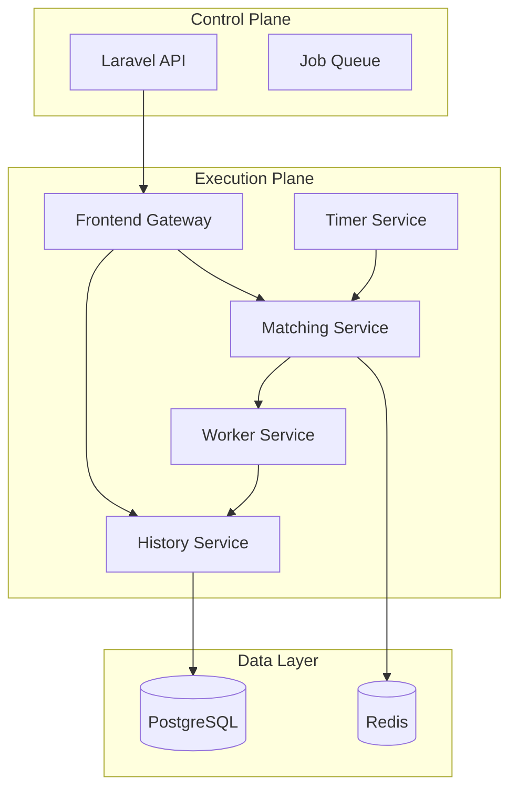

# System Architecture Overview

LinkFlow uses a **hybrid microservices architecture** designed to balance development velocity with execution performance.

## High-Level Design

The system is divided into two primary planes:

1.  **Control Plane (Laravel)**: Handles user interaction, API requests, authentication, and workflow definitions. Optimized for developer productivity and rich features.
2.  **Execution Plane (Go)**: Handles high-concurrency workflow execution, state management, and task processing. Optimized for performance and scalability.

## Core Components

| Component | Technology | Responsibility |
|-----------|------------|----------------|
| **API** | Laravel 12 | REST API, User Auth, Workflow CRUD, Webhooks |
| **Frontend** | Go | Internal API Gateway, AuthZ, Rate Limiting |
| **History** | Go | Event Sourcing, State Persistence |
| **Matching** | Go | Task Queuing, Worker Dispatching |
| **Worker** | Go | Executing Workflow Nodes (HTTP, AI, Scripts) |
| **Timer** | Go | Scheduling, Delays, Timeouts |

## Key Design Decisions

-   **Event Sourcing**: The `History` service stores workflow state as a sequence of immutable events, allowing for complete audit trails and replayability. [See ADR 0002](../adr/0002-workflow-state-management.md).
-   **Hybrid Stack**: Leveraging Laravel for the "boring" parts (CRUD, Auth) and Go for the "hard" parts (Concurrency, Distributed Systems). [See ADR 0001](../adr/0001-hybrid-architecture.md).
-   **gRPC**: Used for all internal communication within the Execution Plane for type safety and performance.
-   **Redis Streams**: Used for reliable task queuing and asynchronous communication between API and Engine.

## Scalability

-   **Stateless Services**: The API, Frontend, and Worker services are stateless and can be scaled horizontally.
-   **Sharding**: The History service shards workflow executions based on `workflow_id`, allowing database partitioning.
-   **Partitioning**: The Matching service partitions task queues to distribute load across multiple nodes.
