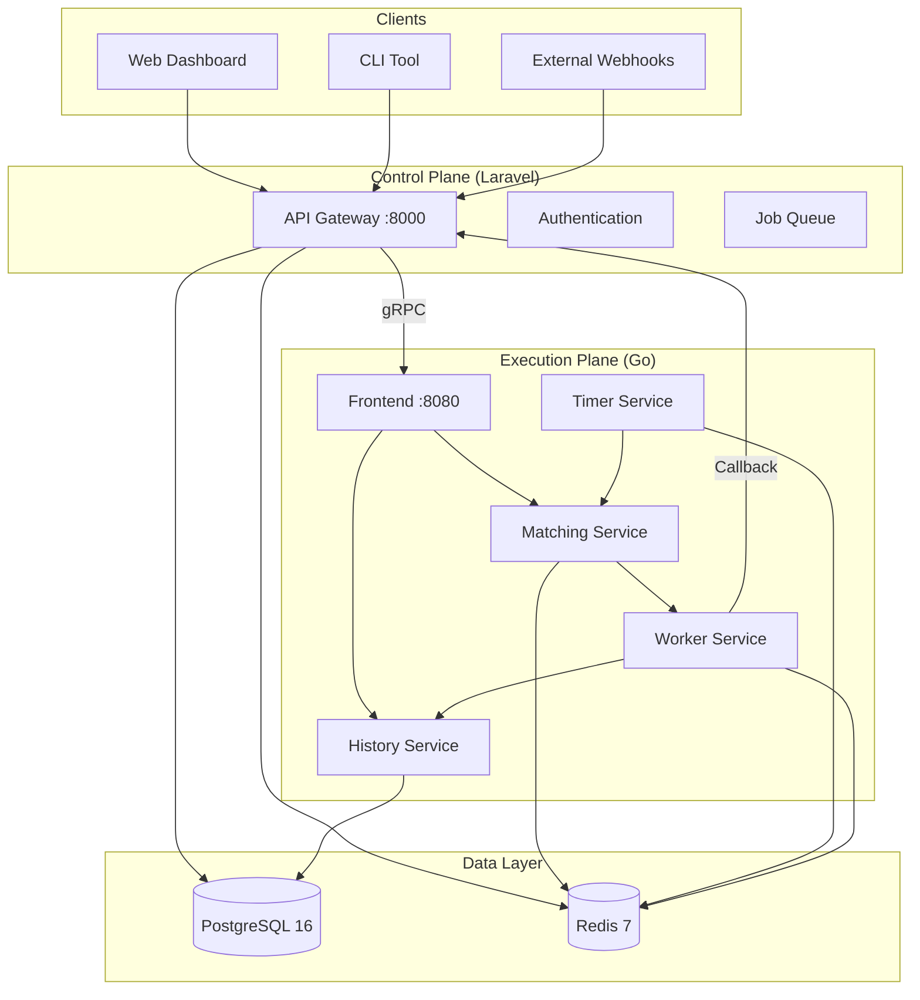
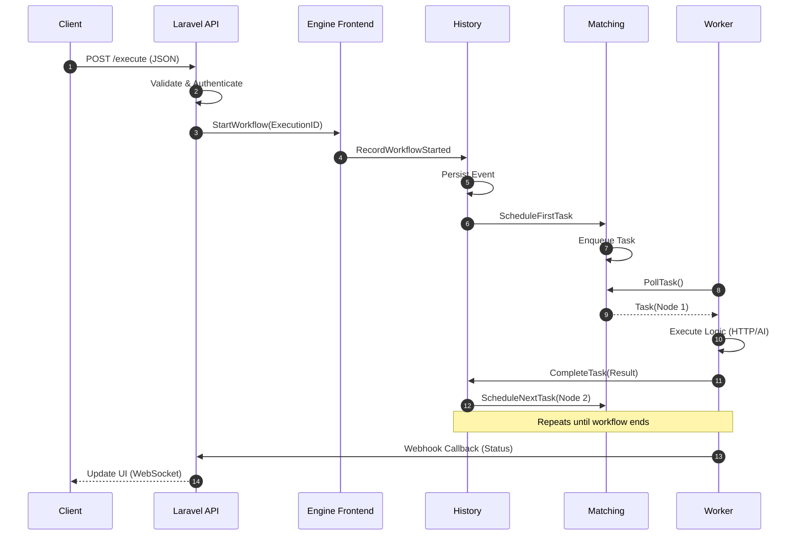
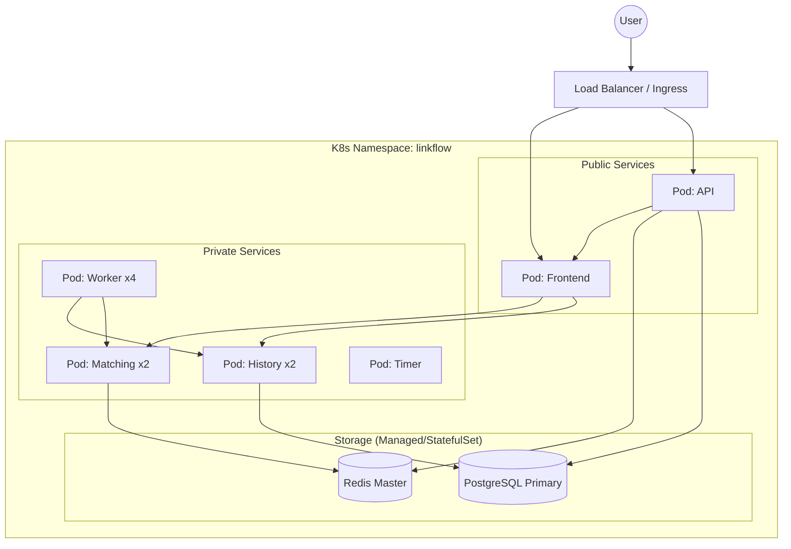

# Architecture Diagrams

This document contains Mermaid definitions for LinkFlow's key architectural views. You can render these in GitHub, VS Code, or any Mermaid-compatible viewer.

## 1. System Overview

High-level view of the Control Plane and Execution Plane.

## 2. Request Data Flow

How a workflow execution request flows through the system.

## 3. Deployment Topology

Physical deployment view on Kubernetes or Docker.

