# Documentation Structure

This document provides a visual map of the LinkFlow documentation to help you find exactly what you need.

## Visual Map

```mermaid
graph TD
    Root[docs/]
    
    %% Main Sections
    GS[01-getting-started/]
    Arch[02-architecture/]
    Guides[03-guides/]
    API[04-api-reference/]
    Deploy[05-deployment/]
    Ops[06-operations/]
    Dev[07-development/]
    ADR[adr/]

    %% Connections
    Root --> GS
    Root --> Arch
    Root --> Guides
    Root --> API
    Root --> Deploy
    Root --> Ops
    Root --> Dev
    Root --> ADR

    %% Getting Started
    GS --> GS1[introduction]
    GS --> GS2[installation]
    GS --> GS3[quickstart]
    GS --> GS4[first-workflow]
    GS --> GS5[concepts]

    %% Architecture
    Arch --> A1[overview]
    Arch --> A2[control-plane]
    Arch --> A3[execution-plane]
    Arch --> A4[data-flow]
    Arch --> A5[security-model]
    Arch --> AD[diagrams/]

    %% Guides
    Guides --> G1[workflows/]
    Guides --> G2[nodes/]
    Guides --> G3[credentials/]
    Guides --> G4[integrations/]
    Guides --> G5[reference/]
    Guides --> G6[cookbook/]

    %% Reference
    G5 --> G5A[expressions]

    %% Cookbook
    G6 --> G6A[fan-out-fan-in]
    G6 --> G6B[human-in-the-loop]
    G6 --> G6C[chatbot-chain]

    %% API
    API --> AP1[openapi.yaml]
    API --> AP2[authentication]
    API --> AP3[rate-limits]
    API --> AP4[postman/]

    %% Deployment
    Deploy --> D1[requirements]
    Deploy --> D2[docker]
    Deploy --> D3[kubernetes]
    Deploy --> D4[configuration]

    %% Operations
    Ops --> O1[monitoring]
    Ops --> O2[backup-restore]
    Ops --> O3[troubleshooting]
    Ops --> O4[incident-response]

    %% Development
    Dev --> DV1[setup]
    Dev --> DV2[code-style]
    Dev --> DV3[testing]
    Dev --> DV4[debugging]
    Dev --> DV5[custom-nodes]

    %% ADR
    ADR --> AD1[0001-hybrid-arch]
    ADR --> AD2[0002-event-sourcing]
    ADR --> AD3[0003-grpc]
```

## Directory Reference

| Directory | Purpose | Target Audience |
|-----------|---------|-----------------|
| **[01-getting-started](./01-getting-started/)** | Onboarding, tutorials, and core concepts. Start here. | New Users |
| **[02-architecture](./02-architecture/)** | Deep dive into system design, components, and data flow. | Architects, Contributors |
| **[03-guides](./03-guides/)** | Practical how-to guides for building workflows and integrations. | Workflow Builders |
| **[04-api-reference](./04-api-reference/)** | Technical reference for the REST API (OpenAPI spec). | Developers |
| **[05-deployment](./05-deployment/)** | Infrastructure setup, Docker, Kubernetes, and configuration. | DevOps, SRE |
| **[06-operations](./06-operations/)** | Runbooks for maintaining the system in production. | DevOps, SRE |
| **[07-development](./07-development/)** | Setup guide for contributing code to LinkFlow. | Contributors |
| **[adr](./adr/)** | Architecture Decision Records - history of major decisions. | Architects |

## File Naming Convention

-   **Numbered Directories** (e.g., `01-getting-started`): Indicates a recommended reading order.
-   **`README.md`**: Index files for navigation.
-   **`kebab-case.md`**: Standard documentation files.
-   **`UPPERCASE.md`**: Special root files (`AGENTS.md`, `CHANGELOG.md`).
